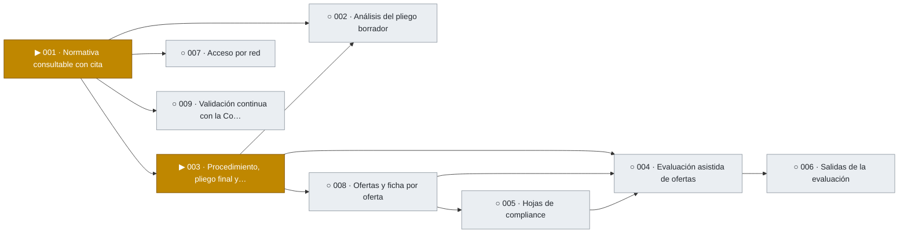
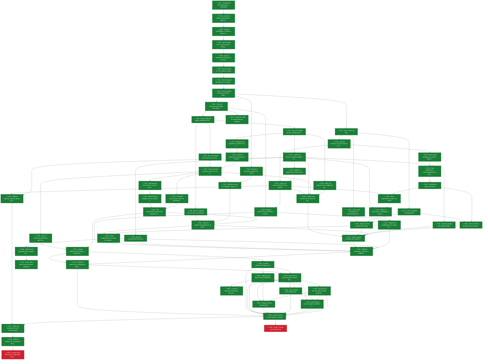

```mermaid
flowchart LR
  E0["✓ 1. Spec"]:::done --> E1["✓ 2. Plan"]:::done --> E2["✓ 3. Tareas"]:::done --> E3["▶ 4. Desarrollo"]:::active --> E4["○ 5. Verificación"]:::todo --> E5["○ 6. Auditoría"]:::todo --> E6["○ 7. Despliegue"]:::todo
  classDef done fill:#1a7f37,stroke:#116329,color:#ffffff
  classDef review fill:#0969da,stroke:#0550ae,color:#ffffff
  classDef active fill:#bf8700,stroke:#7d4e00,color:#ffffff
  classDef blocked fill:#cf222e,stroke:#a40e26,color:#ffffff
  classDef todo fill:#eaeef2,stroke:#8c959f,color:#24292f
```

# Tablero de avance

> Se genera con `python tools/tablero.py` a partir de `specs/`. No editar a mano.

Leyenda: ✓ hecho · ▶ en curso · ◐ en verificación · ○ pendiente · ✕ bloqueada

## Proyecto

| Feature | Qué entrega | Etapa | Tareas | Avance |
|---|---|---|---|---|
| [001 · Normativa consultable con cita](#001) | Las normas de compras cargadas, versionadas y consultables, con cada respuesta respaldada por el artículo que la sostiene | 4 de 7 · Desarrollo | 64/66 | ██████████ 97% |
| 002 · Análisis del pliego borrador | Opcional: un informe de cumplimiento de un pliego borrador contra la normativa, con preguntas a la Comisión sobre lo que no puede resolver, y su matriz de cumplimiento preliminar | No iniciada | — | — |
| [003 · Procedimiento, pliego final y matriz de cumplimiento](#003) | El procedimiento con su fecha de autorización; la carga del pliego final publicado; la matriz de cumplimiento (requisitos formales, económicos y técnicos que debe cumplir la oferta, cada uno con su cita al pliego) armada desde el pliego final y validada por la Comisión | 2 de 7 · Plan | — | — |
| 004 · Evaluación asistida de ofertas | Por cada oferta y cada requisito de la matriz, una propuesta de cumple, no cumple o no determinado con su fundamento (pliego, oferta, compliance, normativa o respuesta de la Comisión) y preguntas a la Comisión sobre lo que no puede resolver; la Comisión confirma, corrige o rechaza | No iniciada | — | — |
| 005 · Hojas de compliance | La carga, por la Comisión, del documento de compliance de cada oferta: lo verificado en sistemas no integrados (por ejemplo, que la póliza de garantía presentada esté vigente o que no haya deudas) | No iniciada | — | — |
| 006 · Salidas de la evaluación | Planilla por oferta y cuadro comparativo; el borrador de acta queda diferido | No iniciada | — | — |
| 007 · Acceso por red | Uso de la pantalla desde otras computadoras, con conexión cifrada y bloqueo tras intentos fallidos de clave | No iniciada | — | — |
| 008 · Ofertas y ficha por oferta | La carga de cada oferta en varios documentos (PDF con texto o escaneado) y una ficha por oferta: síntesis de lo ofrecido frente a cada requisito de la matriz, con los documentos y fragmentos que lo respaldan | No iniciada | — | — |
| 009 · Validación continua con la Comisión | Un circuito único para que la Comisión responda y valide preguntas y respuestas del sistema, y registre sus respuestas. Cada cuestión resuelta puede quedar como fundamento (ADR-0009), como caso para medir al sistema o como pedido de cargar una norma o un documento. Lo que queda sin validar se ve como pendiente. Uso intensivo al principio, y después ante cuestiones que no se saben resolver | No iniciada | — | — |

## 001 · Normativa consultable con cita

**Etapa actual:** 4 de 7 · Desarrollo · [carpeta](../specs/001-normativa)

### Qué falta

- **Próximo paso:** Desarrollar: 2 tareas sin terminar.
- ✕ T-049 · Levantar todo desde cero y dejar datos para el runbook (bloqueada)
- ✕ T-066 · Casos y corrida corta de REQ-019 (bloqueada)

### Qué se hizo

- Etapas completas: Spec, Plan, Tareas.
- ✓ T-001 · Comprobar la GPU dentro de un contenedor (`3b7a8a7` 2026-10-02)
- ✓ T-002 · Levantar el motor de generación y medir su velocidad (`5fdf016` 2026-10-02)
- ✓ T-003 · Levantar embeddings y reranker y medir la memoria de video (`d1eaa07` 2026-10-02)
- ✓ T-004 · Fijar Postgres con sus extensiones y búsqueda en español (`1a9d113` 2026-10-02)
- ✓ T-005 · Armar el esqueleto de Django con sus librerías (`d771da6` 2026-10-02)
- ✓ T-006 · Crear usuarios con rol, ingreso y salida (`4ceae34` 2026-10-02, `f76f0a2` 2026-10-02)
- ✓ T-007 · Crear el registro de auditoría y el alta de usuarios (`960121e` 2026-10-02, `04d537d` 2026-10-02)
- ✓ T-008 · Crear las tablas de normas, lecturas, unidades y pasajes (`210e12f` 2026-10-02)
- ✓ T-009 · Crear las funciones de unidades consultables a una fecha (`9f1886e` 2026-10-02, `b9ca5d3` 2026-10-02)
- ✓ T-010 · Crear la tabla del registro detallado de consultas (`cc485fc` 2026-10-02)
- ✓ T-011 · Crear los clientes de IA, sus dobles y los parámetros (`fb2f640` 2026-10-02)
- ✓ T-012 · Leer un PDF con texto (`977f834` 2026-10-02, `ef7d903` 2026-10-02)
- ✓ T-013 · Partir en artículos y armar el informe mínimo (`a4e0391` 2026-10-03)
- ✓ T-014 · Cargar una norma, listarla y ver su informe (`e53cc24` 2026-10-03, `d115ccf` 2026-10-03)
- ✓ T-015 · Validar una lectura y calcular pasajes y vectores (`420eae6` 2026-10-03, `845bdae` 2026-10-03)
- ✓ T-016 · Armar la pantalla de consulta con sus tres bloques (`ceff61d` 2026-10-03, `bb49b8c` 2026-10-03)
- ✓ T-017 · Recuperar por significado y reordenar con el reranker (`f31dab6` 2026-10-03)
- ✓ T-018 · Generar la respuesta con esquema e insertar las citas (`33f0f08` 2026-10-03, `9830fe5` 2026-10-03)
- ✓ T-019 · Unir la consulta de punta a punta con su registro (`2685761` 2026-10-03, `71fd67b` 2026-10-03)
- ✓ T-020 · Probar el hilo mínimo con los servicios reales (`b520afe` 2026-10-03)
- ✓ T-021 · Leer un PDF escaneado con reconocimiento de texto (`223295e` 2026-10-03, `197dada` 2026-10-03)
- ✓ T-022 · Leer una página web guardada (`3d9224f` 2026-10-03, `c12d12c` 2026-10-03)
- ✓ T-023 · Partir normas completas con incisos, anexos y considerandos (`07000e3` 2026-10-03, `9fcf7ba` 2026-10-03, `b3b20b9` 2026-10-03)
- ✓ T-024 · Partir dictámenes y recomendaciones en puntos y párrafos (`eee73f3` 2026-10-03, `33bb89f` 2026-10-03)
- ✓ T-025 · Completar el informe de lectura (`8d488ab` 2026-10-03, `894c7a7` 2026-10-03, `3986cbf` 2026-10-03)
- ✓ T-026 · Avisar duplicados al cargar una norma (`7ff80c5` 2026-10-03, `dd34b1a` 2026-10-03)
- ✓ T-027 · Releer un documento y reemplazar la lectura anterior (`025253b` 2026-10-03, `154e309` 2026-10-03)
- ✓ T-028 · Integrar los tres formatos en la carga (`0eae60c` 2026-10-03)
- ✓ T-029 · Registrar relaciones entre normas y mostrar los vínculos (`eb8e443` 2026-10-03, `7748cf7` 2026-10-03)
- ✓ T-030 · Registrar versiones de una norma (`2844775` 2026-10-03)
- ✓ T-031 · Partir en pasajes las unidades largas (`282ab7f` 2026-10-03, `955ce90` 2026-10-03, `c1e2088` 2026-10-03)
- ✓ T-032 · Recuperar por tres caminos y unir los candidatos (`fde3aef` 2026-10-03)
- ✓ T-033 · Seleccionar por categoría, sumar cambios y ordenar (`e839ed2` 2026-10-03, `a26c1c1` 2026-10-03)
- ✓ T-034 · Completar instrucciones, marca de regímenes y orden (`c7ad4bc` 2026-10-03, `fc426a7` 2026-10-03)
- ✓ T-035 · Buscar unidades por artículo y por palabras (`5cf1cbc` 2026-10-03, `92ec485` 2026-10-03)
- ✓ T-036 · Entregar el documento original con sesión (`07ea00d` 2026-10-03)
- ✓ T-037 · Mostrar las citas con categoría, papel y cambios (`aa4b436` 2026-10-03, `2ca66e6` 2026-10-03)
- ✓ T-038 · Registrar ingresos, ingresos fallidos y rechazos por rol (`2ef5e3b` 2026-10-03)
- ✓ T-039 · Correr el conjunto de preguntas y medir las exigencias (`df00322` 2026-10-03, `13ae5e6` 2026-10-03, `97c998c` 2026-10-03)
- ✓ T-040 · Unir recuperación y generación completas con su registro (`218774c` 2026-10-03, `ec72483` 2026-10-03, `1479dcd` 2026-10-03)
- ✓ T-041 · Mostrar y registrar la búsqueda en la pantalla (`ae7f271` 2026-10-03, `3e34bf9` 2026-10-03)
- ✓ T-042 · Agregar calibración del umbral y comparación de corridas (`a7af689` 2026-10-03, `ef536b1` 2026-10-03, `32e5b9a` 2026-10-03)
- ✓ T-043 · Cargar y validar el corpus real y ajustar las reglas (`1846ff0` 2026-10-03, `21dfe48` 2026-10-03, `1095c72` 2026-10-03, `5104eb2` 2026-10-03)
- ✓ T-044 · Registrar relaciones, versiones y modificatorias del corpus
- ✓ T-045 · Calibrar el umbral con el conjunto de preguntas (`817b146` 2026-10-03, `10e2c88` 2026-10-03)
- ✓ T-046 · Correr las evals y medir tiempo y memoria
- ✓ T-047 · Probar una consulta con la red desconectada
- ✓ T-048 · Probar el respaldo y la restauración de la base
- ✓ T-050 · Partir la 297/03 y el cuerpo de la 247/2022 desde la web (`c27c9c4` 2026-10-03, `5941a37` 2026-10-03)
- ✓ T-051 · Registrar las modificatorias sin cargar de una norma (`375ba21` 2026-10-03, `73a199a` 2026-10-03)
- ✓ T-052 · Avisar modificatorias sin cargar en respuesta y búsqueda (`5eb1059` 2026-10-03, `84ad9d4` 2026-10-03, `8b43218` 2026-10-03)
- ✓ T-053 · Conservar la eñe en la búsqueda por palabras (`18a8d59` 2026-10-02, `122f9c7` 2026-10-02)
- ✓ T-054 · Pasar a la aplicación las variables de los servicios de IA (`4f4fea7` 2026-10-03)
- ✓ T-055 · Agregar el nombre de cita de la norma (`ff230c8` 2026-10-03, `88796e6` 2026-10-03)
- ✓ T-056 · Mostrar en la búsqueda solo lo vigente, con casilla para los derogados (`7c34545` 2026-10-03)
- ✓ T-057 · Tratar AFIP y ARCA como el mismo organismo (`98b3ef6` 2026-10-03, `d27d51a` 2026-10-03)
- ✓ T-058 · Corrector tolerante de datos clave (`ab1d1f1` 2026-10-03, `9eaddbe` 2026-10-03)
- ✓ T-059 · Reescribir los datos clave del conjunto dorado
- ✓ T-060 · Calibración por hueco, lote de aceptación y margen de error en las evals (`9025f48` 2026-10-03)
- ✓ T-061 · Redactar el lote de aceptación
- ✓ T-062 · Fijar el umbral con la regla nueva (`faff0cc` 2026-10-03, `7c321bd` 2026-10-03)
- ✓ T-063 · Instrucciones para responder la remisión a una norma no cargada (`0b6cbae` 2026-10-03, `d5b96d4` 2026-10-03)
- ✓ T-064 · Reescribir EV-027, EV-028 y EV-029 como preguntas con respuesta
- ✓ T-065 · Corregir la espera intermitente de `test_wait` y el borde de la calibración (`4ff607b` 2026-10-03)

### Mapa de tareas

### Requisitos

| Requisito | Descripción | Tareas | Estado |
|---|---|---|---|
| REQ-001 | El sistema debe incorporar una norma a partir de su documento, registrando tipo, número, organismo emisor, título, fecha de publicación, fecha de vigencia y fuente de donde se obtuvo | T-008, T-014, T-055, T-057 | ✓ cubierto |
| REQ-002 | El sistema debe conservar el documento original de cada norma y permitir verlo | T-014, T-036, T-048 | ✓ cubierto |
| REQ-003 | El sistema debe dividir cada documento en unidades citables, cada una con su ubicación: considerando, artículo, inciso o anexo en las normas, y también el texto normativo que no lleva número de artículo, como una cláusula transitoria, con el nombre que le da el documento; punto o párrafo en dictámenes y recomendaciones | T-008, T-013, T-023, T-024, T-031, T-043, T-050 | ✓ cubierto |
| REQ-004 | El sistema debe entregar, por cada norma incorporada, un informe de lectura: cuántas unidades reconoció, cuáles páginas no pudo leer y qué no pudo ubicar | T-012, T-013, T-014, T-021, T-025, T-027, T-028, T-043 | ✓ cubierto |
| REQ-005 | Una norma debe quedar disponible para consultas solo después de que una persona valide su informe de lectura | T-009, T-015, T-017, T-027, T-032, T-035, T-043 | ✓ cubierto |
| REQ-006 | El sistema debe registrar las relaciones entre normas: cuál modifica, complementa, reglamenta o deroga a cuál. Cuando el cambio alcanza a unidades concretas, la relación se registra entre esas unidades | T-029, T-035, T-041, T-044 | ✓ cubierto |
| REQ-007 | El sistema debe mantener las versiones de cada norma y, para una fecha dada, indicar qué unidades estaban vigentes y qué normas las habían modificado o derogado, mostrando el texto literal de cada una | T-009, T-029, T-030, T-033, T-037, T-044 | ✓ cubierto |
| REQ-008 | El sistema debe responder consultas en lenguaje natural sobre la normativa, y cada afirmación de la respuesta debe llevar la cita de la unidad que la sostiene, con su texto literal | T-001, T-002, T-003, T-004, T-011, T-017, T-018, T-019, T-020, T-031, T-032, T-034, T-039, T-040, T-042, T-046, T-047, T-054, T-057, T-058, T-059, T-060, T-061, T-063, T-064, T-065 | ✓ cubierto |
| REQ-009 | Cuando la normativa cargada no permite responder, el resultado debe ser "no determinado", sin afirmar nada | T-002, T-003, T-011, T-017, T-018, T-019, T-034, T-039, T-040, T-042, T-045, T-046, T-060, T-061, T-062, T-063, T-064, T-065 | ✓ cubierto |
| REQ-010 | El sistema debe permitir buscar unidades por norma y número de artículo, y por palabras del texto, desde la pantalla de consulta. La búsqueda muestra solo las unidades vigentes a la fecha de autorización; las derogadas aparecen solo si la persona lo pide expresamente, marcadas como tales | T-004, T-009, T-035, T-041, T-053, T-056, T-057 | ✓ cubierto |
| REQ-011 | El sistema debe avisar cuando se intenta cargar una norma que ya está incorporada. Si es el mismo archivo, no lo incorpora; si es la misma norma en otro archivo o formato, pide confirmación expresa | T-008, T-026 | ✓ cubierto |
| REQ-012 | El sistema debe registrar cada carga, validación y consulta con lo necesario para reconstruirla: quién, cuándo, sobre qué versión de la normativa, qué se recuperó y qué se respondió | T-007, T-008, T-010, T-014, T-015, T-019, T-020, T-026, T-038, T-040, T-041, T-048, T-049, T-051, T-052, T-054, T-056 | ✕ bloqueado |
| REQ-013 | El sistema debe ofrecer una pantalla de consulta donde una persona escribe su pregunta y ve la respuesta con sus citas; desde cada cita se ve el texto literal de la unidad y se puede abrir la norma original | T-005, T-016, T-019, T-020, T-037, T-047, T-055 | ✓ cubierto |
| REQ-014 | La pantalla de consulta debe distinguir a simple vista una respuesta con fundamento de un resultado "no determinado" | T-016, T-037 | ✓ cubierto |
| REQ-015 | El sistema debe incorporar normas en tres formatos: PDF con texto, PDF escaneado y página web guardada. Cuando el texto de una unidad se obtuvo por reconocimiento sobre una imagen, debe quedar indicado en la unidad y en el informe de lectura | T-012, T-021, T-022, T-025, T-028, T-037, T-043 | ✓ cubierto |
| REQ-016 | El sistema debe exigir usuario y clave para ingresar. Cada usuario tiene un rol: lectura, que permite consultar y buscar; o lectura y escritura, que además permite cargar y validar normas y registrar relaciones y versiones | T-005, T-006, T-007, T-038, T-049 | ✕ bloqueado |
| REQ-017 | El sistema debe registrar la categoría de cada documento: régimen específico, otra normativa aplicable, marco nacional, dictamen legal o recomendación de auditoría | T-008, T-014 | ✓ cubierto |
| REQ-018 | Cada cita debe mostrar la categoría de su documento. En una respuesta, las citas del régimen específico van primero; las del marco nacional se presentan como marco; los dictámenes y las recomendaciones se presentan como criterio que acompaña; los considerandos se presentan como contexto, identificados como tales y después del articulado | T-033, T-034, T-037, T-040, T-046 | ✓ cubierto |
| REQ-019 | Cuando el régimen específico y el marco nacional tratan el mismo punto de manera distinta, la respuesta debe mostrar ambos textos y señalar el del régimen específico como el aplicable | T-033, T-034, T-037, T-040, T-046, T-066 | ✕ bloqueado |
| REQ-020 | Cada consulta y cada búsqueda se hacen para una fecha de autorización del procedimiento, que la persona indica en la pantalla; por defecto es la del día. El sistema responde con lo que regía a esa fecha y muestra qué régimen aplicó | T-008, T-009, T-014, T-016, T-019, T-020, T-032, T-035, T-039, T-041, T-042, T-043, T-044, T-046, T-055, T-056, T-058, T-059, T-061 | ✓ cubierto |
| REQ-021 | El sistema debe permitir registrar que una norma tiene modificatorias todavía no cargadas, identificando cada una. Mientras queden, toda respuesta o búsqueda que muestre una unidad de esa norma avisa que puede haber cambios que el sistema no conoce e indica cuántas modificatorias faltan cargar | T-008, T-039, T-042, T-044, T-046, T-051, T-052, T-057 | ✓ cubierto |

## 003 · Procedimiento, pliego final y matriz de cumplimiento

**Etapa actual:** 2 de 7 · Plan (1 dudas abiertas) · [carpeta](../specs/003-pliego-matriz)

```mermaid
flowchart LR
  E0["✓ 1. Spec"]:::done --> E1["▶ 2. Plan"]:::active --> E2["○ 3. Tareas"]:::todo --> E3["○ 4. Desarrollo"]:::todo --> E4["○ 5. Verificación"]:::todo --> E5["○ 6. Auditoría"]:::todo --> E6["○ 7. Despliegue"]:::todo
  classDef done fill:#1a7f37,stroke:#116329,color:#ffffff
  classDef review fill:#0969da,stroke:#0550ae,color:#ffffff
  classDef active fill:#bf8700,stroke:#7d4e00,color:#ffffff
  classDef blocked fill:#cf222e,stroke:#a40e26,color:#ffffff
  classDef todo fill:#eaeef2,stroke:#8c959f,color:#24292f
```

### Qué falta

- **Próximo paso:** El planificador entrega `plan.md`; lo aprueba el responsable.

### Qué se hizo

- Etapas completas: Spec.

### Requisitos

| Requisito | Descripción | Tareas | Estado |
|---|---|---|---|
| REQ-022 | El sistema debe registrar un procedimiento con su número, tipo, objeto y fecha de autorización, y mostrar el régimen de la AFIP que le corresponde según esa fecha | — | — |
| REQ-023 | El sistema debe permitir cargar el pliego final de un procedimiento como uno o más documentos, conservando cada original sin cambios | — | — |
| REQ-024 | El sistema debe proponer, a partir del pliego cargado, la lista de requisitos que debe cumplir una oferta, cada uno clasificado como formal, económico o técnico | — | — |
| REQ-025 | Cada requisito propuesto debe citar el texto literal del pliego que lo exige, con el documento y la ubicación (página y cláusula, si la hay) | — | — |
| REQ-026 | La Comisión debe poder confirmar, corregir, quitar o agregar requisitos; cada cambio queda registrado con quién lo hizo y cuándo | — | — |
| REQ-027 | Una matriz validada queda fija: cambiarla después genera una versión nueva, sin perder la anterior | — | — |
| REQ-028 | Cuando el sistema no puede ubicar con certeza un tramo del pliego (texto ilegible, tabla mal leída), debe señalarlo para revisión en lugar de omitirlo | — | — |
| REQ-029 | Para cada requisito, el sistema debe proponer las consecuencias posibles de no cumplirlo (por ejemplo, desestimación de la oferta o intimación a subsanar), cada una con su fundamento en el pliego o en la norma aplicable; un integrante de la Comisión confirma una. Si el sistema no encuentra fundamento, la consecuencia queda "no determinada" | — | — |
| REQ-030 | Al pedir la matriz, se debe poder elegir el nivel de revisión (media, alta o exigente; por omisión, alta), y el nivel usado queda registrado con la matriz | — | — |
| REQ-031 | El pliego final incluye las circulares modificatorias y aclaratorias y las preguntas de los oferentes con sus respuestas, si las hay, cada una con su fecha. Cuando una de ellas cambia o precisa un requisito, la matriz aplica el cambio, muestra los dos textos y cita el documento que lo produjo | — | — |
