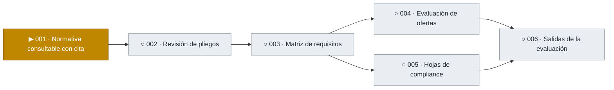

# Tablero de avance

> Se genera con `python tools/tablero.py` a partir de `specs/`. No editar a mano.

Leyenda: ✓ hecho · ▶ en curso · ◐ en verificación · ○ pendiente · ✕ bloqueada

## Proyecto

| Feature | Qué entrega | Etapa | Tareas | Avance |
|---|---|---|---|---|
| [001 · Normativa consultable con cita](#001) | Las normas de compras cargadas, versionadas y consultables, con cada respuesta respaldada por el artículo que la sostiene | 1 de 7 · Spec | — | — |
| 002 · Revisión de pliegos | Observaciones a un pliego contra la normativa, antes de publicarlo | No iniciada | — | — |
| 003 · Matriz de requisitos | Los requisitos del pliego ordenados en una matriz que la Comisión valida | No iniciada | — | — |
| 004 · Evaluación de ofertas | Por cada requisito, una propuesta con su cita; la Comisión confirma, corrige o rechaza | No iniciada | — | — |
| 005 · Hojas de compliance | Carga de las validaciones hechas en sistemas no integrados, por oferta | No iniciada | — | — |
| 006 · Salidas de la evaluación | Planilla por oferta, cuadro comparativo y borrador de acta | No iniciada | — | — |

## 001 · Normativa consultable con cita

**Etapa actual:** 1 de 7 · Spec (spec en borrador, 4 dudas abiertas) · [carpeta](../specs/001-normativa)

### Qué falta

- **Próximo paso:** Resolver 4 dudas marcadas en la spec y aprobar la spec (compuerta del responsable).

### Qué se hizo

- Nada terminado todavía.

### Requisitos

| Requisito | Descripción | Tareas | Estado |
|---|---|---|---|
| REQ-001 | El sistema debe incorporar una norma a partir de su documento, registrando tipo, número, organismo emisor, título, fecha de publicación, fecha de vigencia y fuente de donde se obtuvo | — | — |
| REQ-002 | El sistema debe conservar el documento original de cada norma y permitir verlo | — | — |
| REQ-003 | El sistema debe dividir cada documento en unidades citables, cada una con su ubicación: artículo, inciso o anexo en las normas; punto o párrafo en dictámenes y recomendaciones | — | — |
| REQ-004 | El sistema debe entregar, por cada norma incorporada, un informe de lectura: cuántas unidades reconoció, cuáles páginas no pudo leer y qué no pudo ubicar | — | — |
| REQ-005 | Una norma debe quedar disponible para consultas solo después de que una persona valide su informe de lectura | — | — |
| REQ-006 | El sistema debe registrar las relaciones entre normas: cuál modifica, complementa, reglamenta o deroga a cuál | — | — |
| REQ-007 | El sistema debe mantener las versiones de cada norma y, para una fecha dada, indicar qué unidades estaban vigentes y qué normas las habían modificado o derogado, mostrando el texto literal de cada una | — | — |
| REQ-008 | El sistema debe responder consultas en lenguaje natural sobre la normativa, y cada afirmación de la respuesta debe llevar la cita de la unidad que la sostiene, con su texto literal | — | — |
| REQ-009 | Cuando la normativa cargada no permite responder, el resultado debe ser "no determinado", sin afirmar nada | — | — |
| REQ-010 | El sistema debe permitir buscar unidades por norma y número de artículo, y por palabras del texto | — | — |
| REQ-011 | El sistema debe avisar cuando se intenta cargar una norma que ya está incorporada | — | — |
| REQ-012 | El sistema debe registrar cada carga, validación y consulta con lo necesario para reconstruirla: quién, cuándo, sobre qué versión de la normativa, qué se recuperó y qué se respondió | — | — |
| REQ-013 | El sistema debe ofrecer una pantalla de consulta donde una persona escribe su pregunta y ve la respuesta con sus citas; desde cada cita se ve el texto literal de la unidad y se puede abrir la norma original | — | — |
| REQ-014 | La pantalla de consulta debe distinguir a simple vista una respuesta con fundamento de un resultado "no determinado" | — | — |
| REQ-015 | El sistema debe incorporar normas en tres formatos: PDF con texto, PDF escaneado y página web guardada. Cuando el texto de una unidad se obtuvo por reconocimiento sobre una imagen, debe quedar indicado en la unidad y en el informe de lectura | — | — |
| REQ-016 | El sistema debe exigir usuario y clave para ingresar. Cada usuario tiene un rol: lectura, que permite consultar y buscar; o lectura y escritura, que además permite cargar y validar normas y registrar relaciones y versiones | — | — |
| REQ-017 | El sistema debe registrar la categoría de cada documento: régimen específico, otra normativa aplicable, marco nacional, dictamen legal o recomendación de auditoría | — | — |
| REQ-018 | Cada cita debe mostrar la categoría de su documento. En una respuesta, las citas del régimen específico van primero; las del marco nacional se presentan como marco; los dictámenes y las recomendaciones se presentan como criterio que acompaña | — | — |
| REQ-019 | Cuando el régimen específico y el marco nacional tratan el mismo punto de manera distinta, la respuesta debe mostrar ambos textos y señalar el del régimen específico como el aplicable | — | — |
