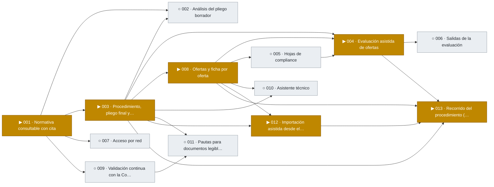
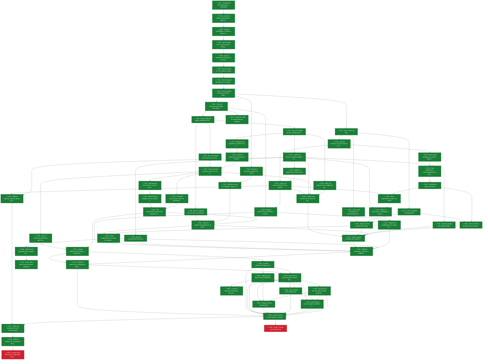
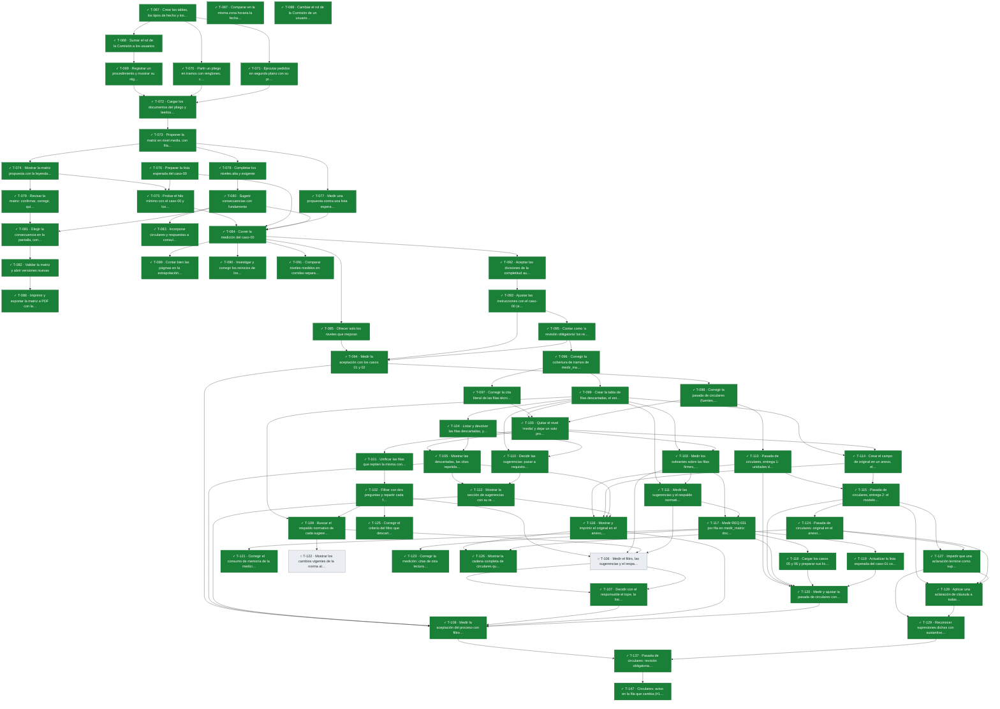
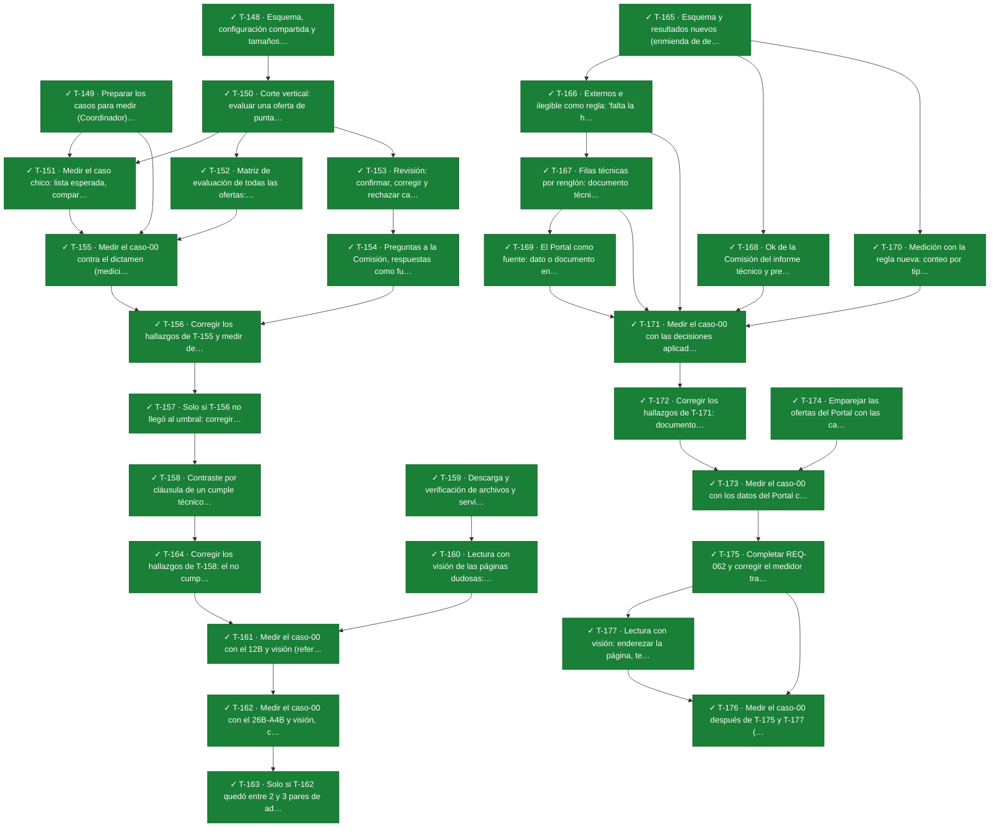
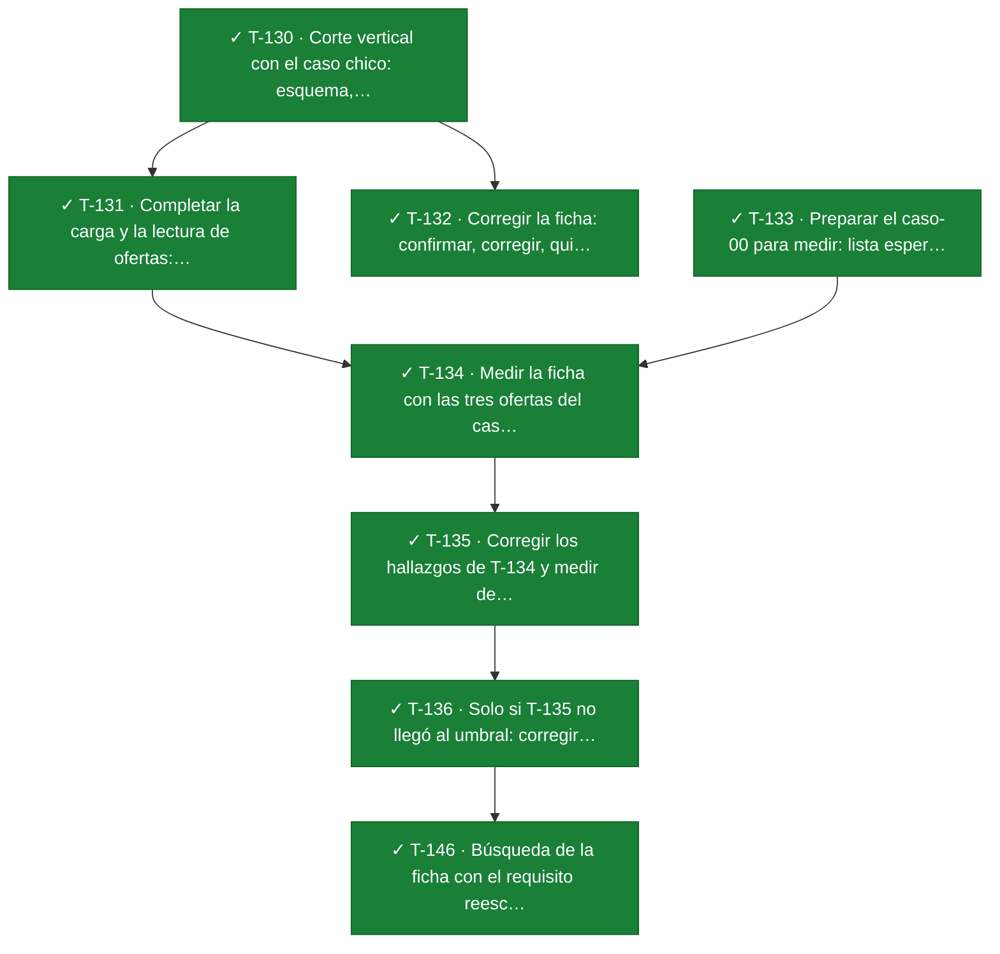
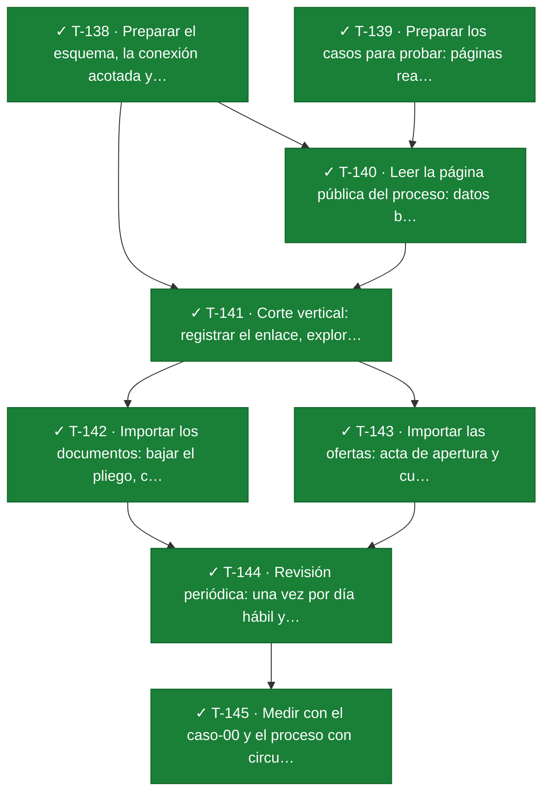

```mermaid
flowchart LR
  E0["✓ 1. Spec"]:::done --> E1["▶ 2. Plan"]:::active --> E2["○ 3. Tareas"]:::todo --> E3["○ 4. Desarrollo"]:::todo --> E4["○ 5. Verificación"]:::todo --> E5["○ 6. Auditoría"]:::todo --> E6["○ 7. Despliegue"]:::todo
  classDef done fill:#1a7f37,stroke:#116329,color:#ffffff
  classDef review fill:#0969da,stroke:#0550ae,color:#ffffff
  classDef active fill:#bf8700,stroke:#7d4e00,color:#ffffff
  classDef blocked fill:#cf222e,stroke:#a40e26,color:#ffffff
  classDef todo fill:#eaeef2,stroke:#8c959f,color:#24292f
```

# Tablero de avance

> Se genera con `python tools/tablero.py` a partir de `specs/`. No editar a mano.

Leyenda: ✓ hecho · ▶ en curso · ◐ en verificación · ○ pendiente · ✕ bloqueada

## Proyecto

| Feature | Qué entrega | Etapa | Tareas | Avance |
|---|---|---|---|---|
| [001 · Normativa consultable con cita](#001) | Las normas de compras cargadas, versionadas y consultables, con cada respuesta respaldada por el artículo que la sostiene | 4 de 7 · Desarrollo | 64/66 | ██████████ 97% |
| 002 · Análisis del pliego borrador | Opcional: un informe de cumplimiento de un pliego borrador contra la normativa, con preguntas a la Comisión sobre lo que no puede resolver, y su matriz de cumplimiento preliminar | No iniciada | — | — |
| [003 · Procedimiento, pliego final y matriz de cumplimiento](#003) | El procedimiento con su fecha de autorización; la carga del pliego final publicado; la matriz de cumplimiento (requisitos formales, económicos y técnicos que debe cumplir la oferta, cada uno con su cita al pliego) armada desde el pliego final y validada por la Comisión | 4 de 7 · Desarrollo | 63/65 | ██████████ 97% |
| [004 · Evaluación asistida de ofertas](#004) | Por cada oferta y cada requisito de la matriz, una propuesta de cumple, no cumple o no determinado con su fundamento (pliego, oferta, compliance, normativa o respuesta de la Comisión) y preguntas a la Comisión sobre lo que no puede resolver; la Comisión confirma, corrige o rechaza | 5 de 7 · Verificación | 30/30 | ██████████ 100% |
| 005 · Hojas de compliance | La carga, por la Comisión, del documento de compliance de cada oferta: lo verificado en sistemas no integrados (por ejemplo, que la póliza de garantía presentada esté vigente o que no haya deudas) | No iniciada | — | — |
| 006 · Salidas de la evaluación | Planilla por oferta y cuadro comparativo; el borrador de acta queda diferido | No iniciada | — | — |
| 007 · Acceso por red | Uso de la pantalla desde otras computadoras, con conexión cifrada y bloqueo tras intentos fallidos de clave | No iniciada | — | — |
| [008 · Ofertas y ficha por oferta](#008) | La carga de cada oferta en varios documentos (PDF con texto o escaneado) y una ficha por oferta: síntesis de lo ofrecido frente a cada requisito de la matriz, con los documentos y fragmentos que lo respaldan | 5 de 7 · Verificación | 8/8 | ██████████ 100% |
| 009 · Validación continua con la Comisión | Un circuito único para que la Comisión responda y valide preguntas y respuestas del sistema, y registre sus respuestas. Cada cuestión resuelta puede quedar como fundamento (ADR-0009), como caso para medir al sistema o como pedido de cargar una norma o un documento. Lo que queda sin validar se ve como pendiente. Uso intensivo al principio, y después ante cuestiones que no se saben resolver | No iniciada | — | — |
| 010 · Asistente técnico | Un asistente que compara la parte técnica de cada oferta con las especificaciones del pliego, renglón por renglón, para ayudar a la Comisión a revisar el informe técnico del área requirente. No es vinculante: el resultado técnico sigue siendo el del área requirente | No iniciada | — | — |
| 011 · Pautas para documentos legibles por IA | Una sección que, con el sistema maduro, genera recomendaciones para redactar pliegos, circulares y aclaraciones de modo que la IA los analice mejor ("AI friendly"), sin perder sentido ni rigor técnico ni legal. Las pautas salen de lo aprendido al leer y medir casos reales en la 003 y siguientes (por ejemplo: circulares con "Donde dice / Debe decir" por cláusula numerada, anexos con título propio, una condición por oración, tablas legibles) y se validan con la Comisión antes de proponerlas | No iniciada | — | — |
| [012 · Importación asistida desde el Portal de Compras](#012) | El sistema explora la página pública del proceso en el Portal de Compras (datos, renglones, documentos, ofertas con totales, garantías y cotización por renglón), propone la carga y la Comisión la aprueba en el momento; revisión periódica de los procesos en curso | 5 de 7 · Verificación | 8/8 | ██████████ 100% |
| [013 · Recorrido del procedimiento (aplicación mínima)](#013) | Una entrada con los procedimientos y, por procedimiento, sus etapas en orden con su estado, el avance en vivo de lo que corre en segundo plano y el acceso a cada decisión de la Comisión | 2 de 7 · Plan | — | — |

## 001 · Normativa consultable con cita

**Etapa actual:** 4 de 7 · Desarrollo · [carpeta](../specs/001-normativa)

### Qué falta

- **Próximo paso:** Desarrollar: 2 tareas sin terminar.
- ✕ T-049 · Levantar todo desde cero y dejar datos para el runbook (bloqueada)
- ✕ T-066 · Casos y corrida corta de REQ-019 (bloqueada)

### Qué se hizo

- Etapas completas: Spec, Plan, Tareas.
- ✓ T-001 · Comprobar la GPU dentro de un contenedor (`3b7a8a7` 2026-10-02)
- ✓ T-002 · Levantar el motor de generación y medir su velocidad (`5fdf016` 2026-10-02)
- ✓ T-003 · Levantar embeddings y reranker y medir la memoria de video (`d1eaa07` 2026-10-02)
- ✓ T-004 · Fijar Postgres con sus extensiones y búsqueda en español (`1a9d113` 2026-10-02)
- ✓ T-005 · Armar el esqueleto de Django con sus librerías (`d771da6` 2026-10-02)
- ✓ T-006 · Crear usuarios con rol, ingreso y salida (`4ceae34` 2026-10-02, `f76f0a2` 2026-10-02)
- ✓ T-007 · Crear el registro de auditoría y el alta de usuarios (`960121e` 2026-10-02, `04d537d` 2026-10-02)
- ✓ T-008 · Crear las tablas de normas, lecturas, unidades y pasajes (`210e12f` 2026-10-02)
- ✓ T-009 · Crear las funciones de unidades consultables a una fecha (`9f1886e` 2026-10-02, `b9ca5d3` 2026-10-02)
- ✓ T-010 · Crear la tabla del registro detallado de consultas (`cc485fc` 2026-10-02)
- ✓ T-011 · Crear los clientes de IA, sus dobles y los parámetros (`fb2f640` 2026-10-02)
- ✓ T-012 · Leer un PDF con texto (`977f834` 2026-10-02, `ef7d903` 2026-10-02)
- ✓ T-013 · Partir en artículos y armar el informe mínimo (`a4e0391` 2026-10-03)
- ✓ T-014 · Cargar una norma, listarla y ver su informe (`e53cc24` 2026-10-03, `d115ccf` 2026-10-03)
- ✓ T-015 · Validar una lectura y calcular pasajes y vectores (`420eae6` 2026-10-03, `845bdae` 2026-10-03)
- ✓ T-016 · Armar la pantalla de consulta con sus tres bloques (`ceff61d` 2026-10-03, `bb49b8c` 2026-10-03)
- ✓ T-017 · Recuperar por significado y reordenar con el reranker (`f31dab6` 2026-10-03)
- ✓ T-018 · Generar la respuesta con esquema e insertar las citas (`33f0f08` 2026-10-03, `9830fe5` 2026-10-03)
- ✓ T-019 · Unir la consulta de punta a punta con su registro (`2685761` 2026-10-03, `71fd67b` 2026-10-03)
- ✓ T-020 · Probar el hilo mínimo con los servicios reales (`b520afe` 2026-10-03)
- ✓ T-021 · Leer un PDF escaneado con reconocimiento de texto (`223295e` 2026-10-03, `197dada` 2026-10-03)
- ✓ T-022 · Leer una página web guardada (`3d9224f` 2026-10-03, `c12d12c` 2026-10-03)
- ✓ T-023 · Partir normas completas con incisos, anexos y considerandos (`07000e3` 2026-10-03, `9fcf7ba` 2026-10-03, `b3b20b9` 2026-10-03)
- ✓ T-024 · Partir dictámenes y recomendaciones en puntos y párrafos (`eee73f3` 2026-10-03, `33bb89f` 2026-10-03)
- ✓ T-025 · Completar el informe de lectura (`8d488ab` 2026-10-03, `894c7a7` 2026-10-03, `3986cbf` 2026-10-03)
- ✓ T-026 · Avisar duplicados al cargar una norma (`7ff80c5` 2026-10-03, `dd34b1a` 2026-10-03)
- ✓ T-027 · Releer un documento y reemplazar la lectura anterior (`025253b` 2026-10-03, `154e309` 2026-10-03)
- ✓ T-028 · Integrar los tres formatos en la carga (`0eae60c` 2026-10-03)
- ✓ T-029 · Registrar relaciones entre normas y mostrar los vínculos (`eb8e443` 2026-10-03, `7748cf7` 2026-10-03)
- ✓ T-030 · Registrar versiones de una norma (`2844775` 2026-10-03)
- ✓ T-031 · Partir en pasajes las unidades largas (`282ab7f` 2026-10-03, `955ce90` 2026-10-03, `c1e2088` 2026-10-03)
- ✓ T-032 · Recuperar por tres caminos y unir los candidatos (`fde3aef` 2026-10-03)
- ✓ T-033 · Seleccionar por categoría, sumar cambios y ordenar (`e839ed2` 2026-10-03, `a26c1c1` 2026-10-03)
- ✓ T-034 · Completar instrucciones, marca de regímenes y orden (`c7ad4bc` 2026-10-03, `fc426a7` 2026-10-03)
- ✓ T-035 · Buscar unidades por artículo y por palabras (`5cf1cbc` 2026-10-03, `92ec485` 2026-10-03)
- ✓ T-036 · Entregar el documento original con sesión (`07ea00d` 2026-10-03)
- ✓ T-037 · Mostrar las citas con categoría, papel y cambios (`aa4b436` 2026-10-03, `2ca66e6` 2026-10-03)
- ✓ T-038 · Registrar ingresos, ingresos fallidos y rechazos por rol (`2ef5e3b` 2026-10-03)
- ✓ T-039 · Correr el conjunto de preguntas y medir las exigencias (`df00322` 2026-10-03, `13ae5e6` 2026-10-03, `97c998c` 2026-10-03)
- ✓ T-040 · Unir recuperación y generación completas con su registro (`218774c` 2026-10-03, `ec72483` 2026-10-03, `1479dcd` 2026-10-03)
- ✓ T-041 · Mostrar y registrar la búsqueda en la pantalla (`ae7f271` 2026-10-03, `3e34bf9` 2026-10-03)
- ✓ T-042 · Agregar calibración del umbral y comparación de corridas (`a7af689` 2026-10-03, `ef536b1` 2026-10-03, `32e5b9a` 2026-10-03)
- ✓ T-043 · Cargar y validar el corpus real y ajustar las reglas (`1846ff0` 2026-10-03, `21dfe48` 2026-10-03, `1095c72` 2026-10-03, `5104eb2` 2026-10-03)
- ✓ T-044 · Registrar relaciones, versiones y modificatorias del corpus
- ✓ T-045 · Calibrar el umbral con el conjunto de preguntas (`817b146` 2026-10-03, `10e2c88` 2026-10-03)
- ✓ T-046 · Correr las evals y medir tiempo y memoria
- ✓ T-047 · Probar una consulta con la red desconectada
- ✓ T-048 · Probar el respaldo y la restauración de la base
- ✓ T-050 · Partir la 297/03 y el cuerpo de la 247/2022 desde la web (`c27c9c4` 2026-10-03, `5941a37` 2026-10-03)
- ✓ T-051 · Registrar las modificatorias sin cargar de una norma (`375ba21` 2026-10-03, `73a199a` 2026-10-03)
- ✓ T-052 · Avisar modificatorias sin cargar en respuesta y búsqueda (`5eb1059` 2026-10-03, `84ad9d4` 2026-10-03, `8b43218` 2026-10-03)
- ✓ T-053 · Conservar la eñe en la búsqueda por palabras (`18a8d59` 2026-10-02, `122f9c7` 2026-10-02)
- ✓ T-054 · Pasar a la aplicación las variables de los servicios de IA (`4f4fea7` 2026-10-03)
- ✓ T-055 · Agregar el nombre de cita de la norma (`ff230c8` 2026-10-03, `88796e6` 2026-10-03)
- ✓ T-056 · Mostrar en la búsqueda solo lo vigente, con casilla para los derogados (`7c34545` 2026-10-03)
- ✓ T-057 · Tratar AFIP y ARCA como el mismo organismo (`98b3ef6` 2026-10-03, `d27d51a` 2026-10-03)
- ✓ T-058 · Corrector tolerante de datos clave (`ab1d1f1` 2026-10-03, `9eaddbe` 2026-10-03)
- ✓ T-059 · Reescribir los datos clave del conjunto dorado
- ✓ T-060 · Calibración por hueco, lote de aceptación y margen de error en las evals (`9025f48` 2026-10-03)
- ✓ T-061 · Redactar el lote de aceptación
- ✓ T-062 · Fijar el umbral con la regla nueva (`faff0cc` 2026-10-03, `7c321bd` 2026-10-03)
- ✓ T-063 · Instrucciones para responder la remisión a una norma no cargada (`0b6cbae` 2026-10-03, `d5b96d4` 2026-10-03)
- ✓ T-064 · Reescribir EV-027, EV-028 y EV-029 como preguntas con respuesta
- ✓ T-065 · Corregir la espera intermitente de `test_wait` y el borde de la calibración (`4ff607b` 2026-10-03)

### Mapa de tareas

### Requisitos

| Requisito | Descripción | Tareas | Estado |
|---|---|---|---|
| REQ-001 | El sistema debe incorporar una norma a partir de su documento, registrando tipo, número, organismo emisor, título, fecha de publicación, fecha de vigencia y fuente de donde se obtuvo | T-008, T-014, T-055, T-057 | ✓ cubierto |
| REQ-002 | El sistema debe conservar el documento original de cada norma y permitir verlo | T-014, T-036, T-048 | ✓ cubierto |
| REQ-003 | El sistema debe dividir cada documento en unidades citables, cada una con su ubicación: considerando, artículo, inciso o anexo en las normas, y también el texto normativo que no lleva número de artículo, como una cláusula transitoria, con el nombre que le da el documento; punto o párrafo en dictámenes y recomendaciones | T-008, T-013, T-023, T-024, T-031, T-043, T-050 | ✓ cubierto |
| REQ-004 | El sistema debe entregar, por cada norma incorporada, un informe de lectura: cuántas unidades reconoció, cuáles páginas no pudo leer y qué no pudo ubicar | T-012, T-013, T-014, T-021, T-025, T-027, T-028, T-043 | ✓ cubierto |
| REQ-005 | Una norma debe quedar disponible para consultas solo después de que una persona valide su informe de lectura | T-009, T-015, T-017, T-027, T-032, T-035, T-043 | ✓ cubierto |
| REQ-006 | El sistema debe registrar las relaciones entre normas: cuál modifica, complementa, reglamenta o deroga a cuál. Cuando el cambio alcanza a unidades concretas, la relación se registra entre esas unidades | T-029, T-035, T-041, T-044 | ✓ cubierto |
| REQ-007 | El sistema debe mantener las versiones de cada norma y, para una fecha dada, indicar qué unidades estaban vigentes y qué normas las habían modificado o derogado, mostrando el texto literal de cada una | T-009, T-029, T-030, T-033, T-037, T-044 | ✓ cubierto |
| REQ-008 | El sistema debe responder consultas en lenguaje natural sobre la normativa, y cada afirmación de la respuesta debe llevar la cita de la unidad que la sostiene, con su texto literal | T-001, T-002, T-003, T-004, T-011, T-017, T-018, T-019, T-020, T-031, T-032, T-034, T-039, T-040, T-042, T-046, T-047, T-054, T-057, T-058, T-059, T-060, T-061, T-063, T-064, T-065 | ✓ cubierto |
| REQ-009 | Cuando la normativa cargada no permite responder, el resultado debe ser "no determinado", sin afirmar nada | T-002, T-003, T-011, T-017, T-018, T-019, T-034, T-039, T-040, T-042, T-045, T-046, T-060, T-061, T-062, T-063, T-064, T-065 | ✓ cubierto |
| REQ-010 | El sistema debe permitir buscar unidades por norma y número de artículo, y por palabras del texto, desde la pantalla de consulta. La búsqueda muestra solo las unidades vigentes a la fecha de autorización; las derogadas aparecen solo si la persona lo pide expresamente, marcadas como tales | T-004, T-009, T-035, T-041, T-053, T-056, T-057 | ✓ cubierto |
| REQ-011 | El sistema debe avisar cuando se intenta cargar una norma que ya está incorporada. Si es el mismo archivo, no lo incorpora; si es la misma norma en otro archivo o formato, pide confirmación expresa | T-008, T-026 | ✓ cubierto |
| REQ-012 | El sistema debe registrar cada carga, validación y consulta con lo necesario para reconstruirla: quién, cuándo, sobre qué versión de la normativa, qué se recuperó y qué se respondió | T-007, T-008, T-010, T-014, T-015, T-019, T-020, T-026, T-038, T-040, T-041, T-048, T-049, T-051, T-052, T-054, T-056 | ✕ bloqueado |
| REQ-013 | El sistema debe ofrecer una pantalla de consulta donde una persona escribe su pregunta y ve la respuesta con sus citas; desde cada cita se ve el texto literal de la unidad y se puede abrir la norma original | T-005, T-016, T-019, T-020, T-037, T-047, T-055 | ✓ cubierto |
| REQ-014 | La pantalla de consulta debe distinguir a simple vista una respuesta con fundamento de un resultado "no determinado" | T-016, T-037 | ✓ cubierto |
| REQ-015 | El sistema debe incorporar normas en tres formatos: PDF con texto, PDF escaneado y página web guardada. Cuando el texto de una unidad se obtuvo por reconocimiento sobre una imagen, debe quedar indicado en la unidad y en el informe de lectura | T-012, T-021, T-022, T-025, T-028, T-037, T-043 | ✓ cubierto |
| REQ-016 | El sistema debe exigir usuario y clave para ingresar. Cada usuario tiene un rol: lectura, que permite consultar y buscar; o lectura y escritura, que además permite cargar y validar normas y registrar relaciones y versiones | T-005, T-006, T-007, T-038, T-049 | ✕ bloqueado |
| REQ-017 | El sistema debe registrar la categoría de cada documento: régimen específico, otra normativa aplicable, marco nacional, dictamen legal o recomendación de auditoría | T-008, T-014 | ✓ cubierto |
| REQ-018 | Cada cita debe mostrar la categoría de su documento. En una respuesta, las citas del régimen específico van primero; las del marco nacional se presentan como marco; los dictámenes y las recomendaciones se presentan como criterio que acompaña; los considerandos se presentan como contexto, identificados como tales y después del articulado | T-033, T-034, T-037, T-040, T-046 | ✓ cubierto |
| REQ-019 | Cuando el régimen específico y el marco nacional tratan el mismo punto de manera distinta, la respuesta debe mostrar ambos textos y señalar el del régimen específico como el aplicable | T-033, T-034, T-037, T-040, T-046, T-066 | ✕ bloqueado |
| REQ-020 | Cada consulta y cada búsqueda se hacen para una fecha de autorización del procedimiento, que la persona indica en la pantalla; por defecto es la del día. El sistema responde con lo que regía a esa fecha y muestra qué régimen aplicó | T-008, T-009, T-014, T-016, T-019, T-020, T-032, T-035, T-039, T-041, T-042, T-043, T-044, T-046, T-055, T-056, T-058, T-059, T-061 | ✓ cubierto |
| REQ-021 | El sistema debe permitir registrar que una norma tiene modificatorias todavía no cargadas, identificando cada una. Mientras queden, toda respuesta o búsqueda que muestre una unidad de esa norma avisa que puede haber cambios que el sistema no conoce e indica cuántas modificatorias faltan cargar | T-008, T-039, T-042, T-044, T-046, T-051, T-052, T-057 | ✓ cubierto |

## 003 · Procedimiento, pliego final y matriz de cumplimiento

**Etapa actual:** 4 de 7 · Desarrollo (1 dudas abiertas) · [carpeta](../specs/003-pliego-matriz)

```mermaid
flowchart LR
  E0["✓ 1. Spec"]:::done --> E1["✓ 2. Plan"]:::done --> E2["✓ 3. Tareas"]:::done --> E3["▶ 4. Desarrollo"]:::active --> E4["○ 5. Verificación"]:::todo --> E5["○ 6. Auditoría"]:::todo --> E6["○ 7. Despliegue"]:::todo
  classDef done fill:#1a7f37,stroke:#116329,color:#ffffff
  classDef review fill:#0969da,stroke:#0550ae,color:#ffffff
  classDef active fill:#bf8700,stroke:#7d4e00,color:#ffffff
  classDef blocked fill:#cf222e,stroke:#a40e26,color:#ffffff
  classDef todo fill:#eaeef2,stroke:#8c959f,color:#24292f
```

### Qué falta

- **Próximo paso:** Desarrollar: 2 tareas sin terminar.
- ○ T-106 · Medir el filtro, las sugerencias y el respaldo normativo con el caso-00 y ajustarlos (pendiente)
- ○ T-122 · Mostrar los cambios vigentes de la norma al proponer consecuencias, o no fundar en unidades modificadas (pendiente)

### Qué se hizo

- Etapas completas: Spec, Plan, Tareas.
- ✓ T-067 · Crear las tablas, los tipos de hecho y los parámetros de la 003 (`bdf0c75` 2026-10-03, `503e52f` 2026-10-03, `c4eec91` 2026-10-03)
- ✓ T-068 · Sumar el rol de la Comisión a los usuarios (`25dca05` 2026-10-03)
- ✓ T-069 · Registrar un procedimiento y mostrar su régimen (`abd641a` 2026-10-03)
- ✓ T-070 · Partir un pliego en tramos con renglones, clase por sección y control de cobertura (`0eb72dc` 2026-10-03, `27c48dc` 2026-10-03)
- ✓ T-071 · Ejecutar pedidos en segundo plano con su propio motor (`126bcf7` 2026-10-03, `d7c2a28` 2026-10-03)
- ✓ T-072 · Cargar los documentos del pliego y leerlos en segundo plano (`ce61ba4` 2026-10-03, `7dd8e36` 2026-10-03, `a8e4455` 2026-10-03)
- ✓ T-073 · Proponer la matriz en nivel media, con filas técnicas por renglón (`4ead4b6` 2026-10-03, `b1fc420` 2026-10-03)
- ✓ T-074 · Mostrar la matriz propuesta con la leyenda de borrador, la cobertura y el aviso de fin (`14bdf45` 2026-10-03)
- ✓ T-075 · Probar el hilo mínimo con el caso-00 y los servicios reales
- ✓ T-076 · Preparar la lista esperada del caso-00
- ✓ T-077 · Medir una propuesta contra una lista esperada (`7f38de6` 2026-10-03, `89be409` 2026-10-03)
- ✓ T-078 · Completar los niveles alta y exigente (`eb07cf5` 2026-10-03, `062b704` 2026-10-03)
- ✓ T-079 · Revisar la matriz: confirmar, corregir, quitar y agregar (`6f1d7ce` 2026-10-04, `99b6f89` 2026-10-04, `079bc82` 2026-10-04)
- ✓ T-080 · Sugerir consecuencias con fundamento (`5bd4a61` 2026-10-04, `9325480` 2026-10-04)
- ✓ T-081 · Elegir la consecuencia en la pantalla, con su motivo (`5c5c251` 2026-10-04, `f7671a6` 2026-10-04)
- ✓ T-082 · Validar la matriz y abrir versiones nuevas (`6075ebf` 2026-10-04, `7aca471` 2026-10-04)
- ✓ T-083 · Incorporar circulares y respuestas a consultas (`0169b78` 2026-10-04, `89ecc70` 2026-10-04, `5b5dcc2` 2026-10-04)
- ✓ T-084 · Correr la medición del caso-00
- ✓ T-085 · Ofrecer solo los niveles que mejoran (`94b2968` 2026-10-04, `83288a8` 2026-10-04)
- ✓ T-086 · Imprimir y exportar la matriz a PDF con la leyenda de borrador (`6eae612` 2026-10-04, `28da1a5` 2026-10-04, `edc112f` 2026-10-04)
- ✓ T-087 · Comparar en la misma zona horaria la fecha de lectura del informe (`5a07f91` 2026-10-03)
- ✓ T-088 · Cambiar el rol de la Comisión de un usuario existente, con registro (`94ab0d5` 2026-10-04)
- ✓ T-089 · Contar bien las páginas en la extrapolación de tiempos (`067485c` 2026-10-04)
- ✓ T-090 · Investigar y corregir los reinicios de los servidores de generación (`2c408bd` 2026-10-04)
- ✓ T-091 · Comparar niveles medidos en corridas separadas (`2bacc1c` 2026-10-04)
- ✓ T-092 · Aceptar las divisiones de la completitud aunque el original no coincida letra por letra (`96533e1` 2026-10-04, `580cc6b` 2026-10-04)
- ✓ T-093 · Ajustar las instrucciones con el caso-00 (enumeraciones, tablas, condiciones como efecto) (`86b2e76` 2026-10-04)
- ✓ T-094 · Medir la aceptación con los casos 01 y 02
- ✓ T-095 · Contar como "a revisión obligatoria" los requisitos en tramos pendientes (`e532652` 2026-10-04, `4480d62` 2026-10-04, `3509e0c` 2026-10-04)
- ✓ T-096 · Corregir la cobertura de tramos de `medir_matriz` cuando hay circulares (`56892b0` 2026-10-04)
- ✓ T-097 · Corregir la cita literal de las filas técnicas con varios documentos en `medir_matriz` (`8e2f6f2` 2026-10-04)
- ✓ T-098 · Corregir la pasada de circulares (fuentes, tramos descartados y no ubicados) (`91dfa17` 2026-10-04, `ade33cd` 2026-10-04)
- ✓ T-099 · Crear la tabla de filas descartadas, el estado de sugerencia, el respaldo normativo, las citas repetidas y los parámetros del filtro (`60b3e30` 2026-10-04)
- ✓ T-100 · Quitar el nivel "media" y dejar un solo proceso registrado (`4b49bad` 2026-10-04, `b271132` 2026-10-04)
- ✓ T-101 · Unificar las filas que repiten la misma condición (`cdae731` 2026-10-04, `c0fb425` 2026-10-04, `432b167` 2026-10-04, `faedb67` 2026-10-04)
- ✓ T-102 · Filtrar con dos preguntas y repartir cada fila en firme, sugerencia o descartada (`387d127` 2026-10-04, `38b1a5a` 2026-10-04)
- ✓ T-103 · Medir los sobrantes sobre las filas firmes, con tope e informe de descartadas (`c631202` 2026-10-04, `73b947a` 2026-10-04)
- ✓ T-104 · Listar y devolver las filas descartadas, y revisar por grupos (`db7c8e2` 2026-10-04)
- ✓ T-105 · Mostrar las descartadas, las citas repetidas y la revisión por grupos (`aeb4cc5` 2026-10-04)
- ✓ T-107 · Decidir con el responsable el tope, la lista y las sugerencias con lo medido en el caso-00
- ✓ T-108 · Medir la aceptación del proceso con filtro y sugerencias con los casos 01 y 02, y REQ-031 con los casos 03 y 04
- ✓ T-109 · Buscar el respaldo normativo de cada sugerencia, sin que nunca la descarte (`deffcef` 2026-10-04, `a83f225` 2026-10-04, `d90da9b` 2026-10-04)
- ✓ T-110 · Decidir las sugerencias: pasar a requisito o quitar, una por una o por grupo, y bloquear la validación (`19b59ad` 2026-10-04)
- ✓ T-111 · Medir las sugerencias y el respaldo normativo: a revisión obligatoria e informe (`1cf2783` 2026-10-04, `4f65104` 2026-10-04)
- ✓ T-112 · Mostrar la sección de sugerencias con su respaldo en la pantalla y en la impresión (`a6115fe` 2026-10-04)
- ✓ T-113 · Pasada de circulares, entrega 1: unidades de cambio aplicadas por clave, sin modelo (`cb8072c` 2026-10-04)
- ✓ T-114 · Crear el campo de original en un anexo, el pedido de extracción de cambios y los parámetros de circulares (`8b858d6` 2026-10-04)
- ✓ T-115 · Pasada de circulares, entrega 2: el modelo extrae la lista de cambios donde no hay clave (`1955dc6` 2026-10-04, `63f815c` 2026-10-04)
- ✓ T-116 · Mostrar y imprimir el original en el anexo, el cambio agrupado y el requisito agregado por una circular (`894321e` 2026-10-04, `f17dce3` 2026-10-04)
- ✓ T-117 · Medir REQ-031 por fila en `medir_matriz`: documento, fecha, texto original y vigente (`d0db99b` 2026-10-04, `f1ff70c` 2026-10-04)
- ✓ T-118 · Cargar los casos 05 y 06 y preparar sus listas esperadas de circulares
- ✓ T-119 · Actualizar la lista esperada del caso-01 con las filas que las circulares afectan
- ✓ T-120 · Medir y ajustar la pasada de circulares con los casos 01, 05 y 06, con estabilidad (`eec12a1` 2026-10-05, `f8b51df` 2026-10-05, `fb8f1b6` 2026-10-05)
- ✓ T-121 · Corregir el consumo de memoria de la medición (citas que cargaban cada una su lectura) (`215300c` 2026-10-04, `39b9103` 2026-10-04)
- ✓ T-123 · Corregir la medición: citas de otra lectura y filas suprimidas por una circular (`367acd8` 2026-10-04, `4f2f044` 2026-10-04)
- ✓ T-124 · Pasada de circulares: original en el anexo por título y requisitos que agrega un "Debe decir" (`1a296ac` 2026-10-04, `464d2ca` 2026-10-04)
- ✓ T-125 · Corregir el criterio del filtro que descartó requisitos reales (`42646c1` 2026-10-04, `2e72018` 2026-10-04, `409557a` 2026-10-04)
- ✓ T-126 · Mostrar la cadena completa de circulares que modifican una misma condición (`e745b70` 2026-10-05, `5a4c0da` 2026-10-05)
- ✓ T-127 · Impedir que una aclaración termine como supresión y registrar la versión de `circulares_cambios` (`064c2c8` 2026-10-05, `678ff48` 2026-10-05)
- ✓ T-128 · Aplicar una aclaración de cláusula a todas sus citas (`aef659f` 2026-10-05, `dac4513` 2026-10-05)
- ✓ T-129 · Reconocer supresiones dichas con sustantivo y aplicar la aclaración de un renglón a sus citas (`83bf814` 2026-10-05)
- ✓ T-137 · Pasada de circulares: revisión obligatoria visible ante un cambio sin resolver y las tres causas de la aceptación a ciegas (`791260a` 2026-10-05, `a2d546c` 2026-10-05, `1159d3b` 2026-10-05, `9e1eff1` 2026-10-05, `c0281a2` 2026-10-05, `25a7b4d` 2026-10-05, `0f14d17` 2026-10-05)
- ✓ T-147 · Circulares: aviso en la fila que cambia (#183) y medición del criterio de ADR-0034 (`0b214c5` 2026-10-05, `c954243` 2026-10-05, `e7f2554` 2026-10-05)

### Mapa de tareas

### Requisitos

| Requisito | Descripción | Tareas | Estado |
|---|---|---|---|
| REQ-022 | El sistema debe registrar un procedimiento con su número, tipo, objeto y fecha de autorización, y mostrar el régimen de la AFIP que le corresponde según esa fecha | T-067, T-069, T-075 | ✓ cubierto |
| REQ-023 | El sistema debe permitir cargar el pliego final de un procedimiento como uno o más documentos, conservando cada original sin cambios | T-067, T-072, T-075 | ✓ cubierto |
| REQ-024 | El sistema debe proponer, a partir del pliego cargado, la lista de requisitos que debe cumplir una oferta, cada uno clasificado como formal, económico o técnico | T-067, T-070, T-071, T-073, T-074, T-075, T-076, T-077, T-078, T-084, T-090, T-092, T-093, T-094, T-095, T-102, T-103, T-106, T-108, T-111, T-121, T-123, T-125, T-147 | ▶ en proceso |
| REQ-025 | Cada requisito propuesto debe citar el texto literal del pliego que lo exige, con el documento y la ubicación (página y cláusula, si la hay) | T-067, T-070, T-073, T-074, T-075, T-076, T-077, T-084, T-094, T-097, T-101, T-108 | ✓ cubierto |
| REQ-026 | La Comisión debe poder confirmar, corregir, quitar o agregar requisitos; cada cambio queda registrado con quién lo hizo y cuándo | T-067, T-068, T-079, T-082, T-088, T-104, T-110 | ✓ cubierto |
| REQ-027 | Una matriz validada queda fija: cambiarla después genera una versión nueva, sin perder la anterior | T-067, T-068, T-082 | ✓ cubierto |
| REQ-028 | Cuando el sistema no puede ubicar con certeza un tramo del pliego (texto ilegible, tabla mal leída), debe señalarlo para revisión en lugar de omitirlo | T-067, T-070, T-072, T-073, T-074, T-075, T-077, T-079, T-082, T-098, T-113 | ✓ cubierto |
| REQ-029 | Para cada requisito, el sistema debe proponer las consecuencias posibles de no cumplirlo (por ejemplo, desestimación de la oferta o intimación a subsanar), cada una con su fundamento en el pliego o en la norma aplicable; un integrante de la Comisión confirma una. Si el sistema no encuentra fundamento, la consecuencia queda "no determinada" | T-067, T-068, T-080, T-081, T-084, T-122 | ▶ en proceso |
| REQ-030 | La matriz se propone siempre con un único proceso de revisión, el más completo disponible, y queda registrado con la matriz qué proceso y qué versión de instrucciones se usaron | T-067, T-071, T-073, T-074, T-077, T-078, T-084, T-085, T-089, T-090, T-091, T-094, T-096, T-097, T-099, T-100, T-103, T-108, T-121 | ✓ cubierto |
| REQ-031 | El pliego final incluye las circulares modificatorias y aclaratorias y las preguntas de los oferentes con sus respuestas, si las hay, cada una con su fecha. Cuando una de ellas cambia o precisa un requisito, la matriz aplica el cambio, muestra los dos textos y cita el documento que lo produjo | T-067, T-072, T-074, T-083, T-094, T-098, T-108, T-113, T-114, T-115, T-116, T-117, T-118, T-119, T-120, T-123, T-124, T-126, T-127, T-128, T-129, T-137, T-147 | ✓ cubierto |
| REQ-033 | Antes de mostrar la matriz propuesta, el sistema debe descartar las filas que no son requisitos de la oferta y unificar las que repiten la misma condición. Lo descartado no desaparece: queda en una lista aparte, cada fila con su cita y el motivo, que la Comisión puede abrir y devolver a la matriz | T-099, T-101, T-102, T-103, T-104, T-105, T-106, T-107, T-108, T-125 | ▶ en proceso |
| REQ-034 | La Comisión debe poder confirmar o quitar de una vez un grupo de requisitos propuestos de un mismo tramo o cláusula; cada fila del grupo queda registrada como si se hubiera revisado por separado, con quién y cuándo | T-104, T-105, T-110, T-112 | ✓ cubierto |
| REQ-035 | La matriz propuesta debe separar los requisitos que el sistema da por firmes de las **sugerencias de condición**: condiciones plausibles sobre las que el sistema duda. Las sugerencias van en una sección aparte, cada una con su cita y el motivo de la duda; la Comisión decide cada una (o por grupo, REQ-034) si pasa a requisito o se quita, y la matriz no se puede validar mientras quede una sugerencia sin decidir | T-099, T-102, T-103, T-106, T-107, T-108, T-110, T-111, T-112 | ▶ en proceso |
| REQ-036 | Para cada sugerencia de condición y cada fila dudosa, el sistema debe buscar en la normativa aplicable (según REQ-022) si el régimen exige esa condición a las ofertas; si la encuentra, la muestra con la cita de la norma como respaldo y puede proponerla como requisito. La normativa solo sirve para confirmar: que una condición no figure en la norma nunca es motivo para descartarla, porque el pliego puede agregar exigencias propias | T-099, T-106, T-108, T-109, T-111, T-112 | ▶ en proceso |
| REQ-032 | Una matriz que todavía no está validada se puede ver en pantalla, imprimir y exportar a PDF, siempre con la leyenda "BORRADOR INCOMPLETO" bien visible en cada página. Una matriz validada sale sin esa leyenda, con su versión y la fecha y el evaluador que la validó | T-067, T-074, T-082, T-086, T-105, T-112, T-116 | ✓ cubierto |

## 004 · Evaluación asistida de ofertas

**Etapa actual:** 5 de 7 · Verificación (1 dudas abiertas) · [carpeta](../specs/004-evaluacion-asistida)

```mermaid
flowchart LR
  E0["✓ 1. Spec"]:::done --> E1["✓ 2. Plan"]:::done --> E2["✓ 3. Tareas"]:::done --> E3["✓ 4. Desarrollo"]:::done --> E4["▶ 5. Verificación"]:::active --> E5["○ 6. Auditoría"]:::todo --> E6["○ 7. Despliegue"]:::todo
  classDef done fill:#1a7f37,stroke:#116329,color:#ffffff
  classDef review fill:#0969da,stroke:#0550ae,color:#ffffff
  classDef active fill:#bf8700,stroke:#7d4e00,color:#ffffff
  classDef blocked fill:#cf222e,stroke:#a40e26,color:#ffffff
  classDef todo fill:#eaeef2,stroke:#8c959f,color:#24292f
```

### Qué falta

- **Próximo paso:** Verificar: el testeador evaluador cierra las tareas y entrega `informe-pruebas.md`.

### Qué se hizo

- Etapas completas: Spec, Plan, Tareas, Desarrollo.
- ✓ T-148 · Esquema, configuración compartida y tamaños: módulo `assessment` con todas sus tablas y triggers, tipo de pedido y de hecho, contexto del motor de lotes, `medir_tamanos` y `entorno.md` (`40cf449` 2026-10-06, `dfbe9c4` 2026-10-06, `fc67181` 2026-10-06, `6eee1fc` 2026-10-06)
- ✓ T-149 · Preparar los casos para medir (Coordinador): caso chico calcado de ofertas reales y lista esperada del dictamen del caso-00, con la lista de fichas completada (`f606137` 2026-10-06)
- ✓ T-150 · Corte vertical: evaluar una oferta de punta a punta (lectura completa por grupos, cita ubicada, contraste, cuatro resultados, preguntas formuladas) con pantalla mínima del par (`557dd54` 2026-10-06, `d4849ea` 2026-10-06, `ccb9567` 2026-10-06, `2a01ea9` 2026-10-06)
- ✓ T-151 · Medir el caso chico: lista esperada, comparación y comando `medir_evaluacion` (`90013ce` 2026-10-06, `cb8bc30` 2026-10-06, `34dc67d` 2026-10-06, `2991f18` 2026-10-06)
- ✓ T-152 · Matriz de evaluación de todas las ofertas: descarte propuesto, orden económico con el Portal, estado por oferta y aviso de versión (`4d4d086` 2026-10-06, `840c6c1` 2026-10-06)
- ✓ T-153 · Revisión: confirmar, corregir y rechazar cada propuesta, con historial y fundamentos a la vista (`f6e762e` 2026-10-06)
- ✓ T-154 · Preguntas a la Comisión, respuestas como fundamento y subsanación con su recorrido (`9c7b6b3` 2026-10-06, `4680f97` 2026-10-06, `caea596` 2026-10-06)
- ✓ T-155 · Medir el caso-00 contra el dictamen (medición base)
- ✓ T-156 · Corregir los hallazgos de T-155 y medir de nuevo (ronda 1) (`eafd501` 2026-10-06, `56a46fb` 2026-10-06, `aaf996d` 2026-10-06, `5d684a2` 2026-10-06)
- ✓ T-157 · Solo si T-156 no llegó al umbral: corregir y medir de nuevo (ronda 2, la última) (`970baf6` 2026-10-06, `a3af7ad` 2026-10-06)
- ✓ T-158 · Contraste por cláusula de un cumple técnico: cero contradicciones con el dictamen (tercera ronda por la contradicción M-051, decisión del responsable) (`c6aded5` 2026-10-06)
- ✓ T-164 · Corregir los hallazgos de T-158: el no cumple técnico exige una cita de la oferta que contradiga la cláusula (F-1) y el contraste por cláusula acota cláusulas y tokens (F-2); se mide con T-161 (`0ba1662` 2026-10-06)
- ✓ T-159 · Descarga y verificación de archivos y servicio: proyector del 12B, 26B-A4B con su proyector, variables propias del lote, `--mmproj`, archivo `docker-compose.modelo-grande.yml`, prueba de humo con imagen y memoria medida (`4289622` 2026-10-06)
- ✓ T-160 · Lectura con visión de las páginas dudosas: criterio, imagen, transcripción, lectura nueva con origen `vision`, registro y pantalla rotulada, con tests (`5ab2597` 2026-10-06, `95ad3d3` 2026-10-06)
- ✓ T-161 · Medir el caso-00 con el 12B y visión (referencia, y medición de la visión y de T-164) (`9816e02` 2026-10-06)
- ✓ T-162 · Medir el caso-00 con el 26B-A4B y visión, comparar con T-161 y decidir según el umbral (ronda 1)
- ✓ T-163 · Solo si T-162 quedó entre 2 y 3 pares de adoptarlo: un cambio igual para los dos modelos y las dos corridas de nuevo (ronda 2, la última)
- ✓ T-165 · Esquema y resultados nuevos (enmienda de decisiones literales): motivos nuevos de "no determinado", opinión y hechos en el resultado, cita del Portal, tabla del ok del informe técnico, versión de reglas y marcador de pruebas (`7d3f260` 2026-10-06)
- ✓ T-166 · Externos e ilegible como regla: "falta la hoja de compliance" (catálogo y marca del modelo) y "no se pudo leer" con documento y página del informe de lectura (`9d35656` 2026-10-06, `654c21a` 2026-10-06)
- ✓ T-167 · Filas técnicas por renglón: documento técnico y renglones con oferta como hechos, resultado "pendiente del informe técnico" y la opinión como información (`a2967fb` 2026-10-06, `4da445b` 2026-10-06)
- ✓ T-168 · Ok de la Comisión del informe técnico y presentación en la matriz de los resultados nuevos (`4d610a8` 2026-10-06, `880e5b4` 2026-10-06, `ca115e7` 2026-10-06)
- ✓ T-169 · El Portal como fuente: dato o documento en el Portal, falta de coincidencia y cita del Portal (`ba7dd3e` 2026-10-07, `dea0bdc` 2026-10-06)
- ✓ T-170 · Medición con la regla nueva: conteo por tipo de par, `--verificar-decisiones` y actualización de la lista esperada del caso-00 (Coordinador, fuera del repositorio) (`5e64fa0` 2026-10-06, `7cda665` 2026-10-06, `bc98c7e` 2026-10-06)
- ✓ T-171 · Medir el caso-00 con las decisiones aplicadas (medición final, una sola)
- ✓ T-172 · Corregir los hallazgos de T-171: documento técnico afirmado por una línea de precio (H-3), ilegible del pagaré en todos los pares de la garantía (H-4), M-008 y M-016 externos (H-5), hechos técnicos de una oferta sin ficha (H-6) (`f43776d` 2026-10-07, `df7904d` 2026-10-07)
- ✓ T-173 · Medir el caso-00 con los datos del Portal cargados (ronda 2, la última, ADR-0025)
- ✓ T-174 · Emparejar las ofertas del Portal con las cargadas a mano (CUIT o nombre normalizado, como propuesta del evaluador), necesario para cargar el Portal del caso-00 (`b3ec5dd` 2026-10-07, `2732a6d` 2026-10-07)
- ✓ T-175 · Completar REQ-062 y corregir el medidor tras T-173: cita del Portal de la cotización y de la garantía cuando la oferta no la trae; la medición cuenta la fila técnica pendiente con hechos correctos aunque falte el documento; externos de habilidad y de la póliza electrónica reconocidos por el título del tramo y la norma de la Superintendencia (ronda extra por requisito incompleto, ADR-0025) (`cb829a0` 2026-10-07, `3f9bc34` 2026-10-07)
- ✓ T-177 · Lectura con visión: enderezar la página, texto plano con marcador de fin, penalizar la repetición y franjas a mayor resolución (el pagaré del caso-00 es legible: lo verificó el responsable) (`50e3533` 2026-10-07)
- ✓ T-176 · Medir el caso-00 después de T-175 y T-177 (medición final)

### Mapa de tareas

### Requisitos

| Requisito | Descripción | Tareas | Estado |
|---|---|---|---|
| REQ-052 | Para cada oferta y cada requisito de la matriz validada, el sistema debe proponer un resultado: cumple, no cumple, no se encontró el documento, o no determinado (con duda o sin corroborar, citando lo que tiene). | T-148, T-149, T-150, T-151, T-155, T-156, T-157, T-158, T-164, T-159, T-160, T-161, T-162, T-163, T-170, T-171, T-173, T-175, T-176 | ✓ cubierto |
| REQ-053 | Cada propuesta debe traer su fundamento citado: el texto del requisito (pliego o circular), el texto de la oferta que lo sostiene (documento y página, texto literal) y, si lo usa, la norma con su artículo o la respuesta registrada de la Comisión. Sin fundamento citado, el resultado es "no determinado". | T-148, T-149, T-150, T-151, T-153, T-155, T-156, T-157, T-158, T-164, T-160, T-161, T-162, T-163, T-170, T-171 | ✓ cubierto |
| REQ-054 | Para proponer, el sistema debe leer completos los documentos de la oferta que pueden responder el requisito, no solo los pasajes que encuentra una búsqueda. | T-148, T-149, T-150, T-151, T-155, T-156, T-157, T-160, T-161, T-162, T-163, T-171, T-177 | ✓ cubierto |
| REQ-055 | Cuando no puede resolver un requisito con el pliego, la oferta, la normativa o lo ya respondido, el sistema debe formular una pregunta concreta a la Comisión. Una pregunta sin respuesta deja el requisito en "no determinado" y se informa. | T-150, T-151, T-154 | ✓ cubierto |
| REQ-056 | El evaluador debe poder confirmar, corregir o rechazar cada propuesta, y responder las preguntas. Cada decisión y cada respuesta quedan registradas con quién y cuándo (P6). Una respuesta puede servir de fundamento en otros requisitos (ADR-0009). | T-148, T-153, T-154 | ✓ cubierto |
| REQ-057 | La evaluación de una oferta se arma contra una versión de la matriz validada y lo indica; si la matriz cambia, se avisa. | T-148, T-152 | ✓ cubierto |
| REQ-058 | El sistema debe mostrar, por oferta, el estado de la evaluación: requisitos por estado y preguntas abiertas. | T-152 | ✓ cubierto |
| REQ-059 | La evaluación se pide para todas las ofertas del procedimiento a la vez y se presenta como una **matriz de evaluación** (ofertas por requisitos). Las ofertas que no cumplen requisitos formales o técnicos quedan señaladas como descartadas, con el requisito y su fundamento, y las demás se **ordenan por lo económico** (precio total y por renglón, con la cotización del Portal cuando la hay). El descarte y el orden son propuestas: decide la Comisión. | T-149, T-150, T-152, T-155, T-156, T-157, T-161, T-162, T-163, T-171 | ✓ cubierto |
| REQ-060 | Cuando el pliego exige un documento que no está en la oferta, el resultado es "no se encontró el documento", con la cita del pliego; no es "no cumple". La Comisión decide: puede pedir que se subsane y, si el oferente lo presenta, el documento se agrega a la oferta y ese requisito se vuelve a evaluar, con registro de todo el recorrido. | T-149, T-150, T-151, T-154 | ✓ cubierto |

## 008 · Ofertas y ficha por oferta

**Etapa actual:** 5 de 7 · Verificación (1 dudas abiertas) · [carpeta](../specs/008-ofertas-ficha)

### Qué falta

- **Próximo paso:** Verificar: el testeador evaluador cierra las tareas y entrega `informe-pruebas.md`.

### Qué se hizo

- Etapas completas: Spec, Plan, Tareas, Desarrollo.
- ✓ T-130 · Corte vertical con el caso chico: esquema, carga, lectura (texto y escaneo), ficha, pantalla mínima y medición (`7a40aff` 2026-10-05, `00dbbc4` 2026-10-05, `6a83b15` 2026-10-05, `7e84c95` 2026-10-05, `25794ca` 2026-10-05, `afe69e1` 2026-10-05, `e8d7295` 2026-10-05, `384cb43` 2026-10-05)
- ✓ T-131 · Completar la carga y la lectura de ofertas: pantalla, fotos sueltas, segundo intento de lectura y lista de páginas no leídas (`069e87a` 2026-10-05, `25e603a` 2026-10-05, `a434c41` 2026-10-05)
- ✓ T-132 · Corregir la ficha: confirmar, corregir, quitar y agregar fragmentos, historial y aviso de versión de la matriz (`d0bac35` 2026-10-05)
- ✓ T-133 · Preparar el caso-00 para medir: lista esperada de fichas de las tres ofertas y matriz validada (Coordinador)
- ✓ T-134 · Medir la ficha con las tres ofertas del caso-00 (medición base)
- ✓ T-135 · Corregir los hallazgos de T-134 y medir de nuevo (ronda 1) (`a32ec1c` 2026-10-05, `627d9de` 2026-10-05, `97423bd` 2026-10-05, `fdedec7` 2026-10-05, `4974944` 2026-10-05, `74c12a0` 2026-10-05)
- ✓ T-136 · Solo si T-135 no llegó al umbral: corregir y medir de nuevo (ronda 2, la última) (`eeae37f` 2026-10-05, `d514129` 2026-10-05, `8477cd8` 2026-10-05, `c6d8d9d` 2026-10-05)
- ✓ T-146 · Búsqueda de la ficha con el requisito reescrito como lo diría una oferta (`f9da6a6` 2026-10-05)

### Mapa de tareas

### Requisitos

| Requisito | Descripción | Tareas | Estado |
|---|---|---|---|
| REQ-037 | El sistema debe permitir registrar las ofertas de un procedimiento, cada una con su oferente, y cargar en cada una varios documentos. | T-130, T-131 | ✓ cubierto |
| REQ-038 | El sistema debe leer los documentos con texto y los escaneados o fotografiados, e informar qué páginas no pudo leer o leyó con baja confianza. | T-130, T-131, T-134, T-135, T-136 | ✓ cubierto |
| REQ-039 | Para cada oferta y cada requisito de la matriz validada, el sistema debe proponer los fragmentos de la oferta que responden al requisito, cada uno con el documento, la página y el texto literal. | T-130, T-133, T-134, T-135, T-136, T-146 | ✓ cubierto |
| REQ-040 | Cuando no encuentra ningún fragmento para un requisito, el sistema debe decirlo expresamente en la ficha ("no se encontró en la oferta"), sin dejar el requisito vacío ni suponer. | T-130, T-133, T-134, T-135, T-136, T-146 | ✓ cubierto |
| REQ-041 | La ficha debe mostrar una síntesis breve de lo ofrecido para cada requisito, sin juicio de cumplimiento. | T-130, T-134, T-135, T-136 | ✓ cubierto |
| REQ-042 | La Comisión debe poder confirmar, corregir, quitar o agregar fragmentos de la ficha. Cada cambio queda registrado con quién y cuándo (P6). | T-132 | ✓ cubierto |
| REQ-043 | La ficha se arma solo contra una matriz validada. Si la matriz cambia de versión, la ficha indica con qué versión se armó. | T-130, T-132 | ✓ cubierto |
| REQ-044 | Para la parte técnica, la ficha indica si la oferta trae documentación técnica y, cuando el pliego tiene renglones, si el oferente cotizó o no cada renglón. No compara el contenido técnico con las especificaciones (eso es la feature 010). | T-130, T-133, T-134, T-135, T-136 | ✓ cubierto |

## 012 · Importación asistida desde el Portal de Compras

**Etapa actual:** 5 de 7 · Verificación (1 dudas abiertas) · [carpeta](../specs/012-portal-compras)

### Qué falta

- **Próximo paso:** Verificar: el testeador evaluador cierra las tareas y entrega `informe-pruebas.md`.

### Qué se hizo

- Etapas completas: Spec, Plan, Tareas, Desarrollo.
- ✓ T-138 · Preparar el esquema, la conexión acotada y la cola del Portal: tablas de `portal`, cambios de `tenders_job` y de auditoría, servicio `portal_worker`, cliente HTTP con lista de destinos y `entorno.md` (`f245f36` 2026-10-05, `3e2d665` 2026-10-05)
- ✓ T-139 · Preparar los casos para probar: páginas reales del caso-00 y de un proceso con circulares (fuera del repositorio), calcos con datos inventados y lista esperada (Coordinador) (`69db5db` 2026-10-05)
- ✓ T-140 · Leer la página pública del proceso: datos básicos, renglones, cronograma, garantías y lista de documentos, con el texto normalizado (`c4ad118` 2026-10-05)
- ✓ T-141 · Corte vertical: registrar el enlace, explorar, proponer, aprobar ítem por ítem y cargar el procedimiento y los renglones, con pantalla (`1f1bfb5` 2026-10-05, `afe81f4` 2026-10-05, `0af9c1c` 2026-10-05)
- ✓ T-142 · Importar los documentos: bajar el pliego, circulares y demás con su huella y cargarlos por `load_document` (`1ba8be3` 2026-10-05)
- ✓ T-143 · Importar las ofertas: acta de apertura y cuadro comparativo, ofertas con garantía y cotización por renglón (`5f6c49b` 2026-10-05)
- ✓ T-144 · Revisión periódica: una vez por día hábil y a demanda, con novedades y sin repetir lo decidido (`39c5dfd` 2026-10-06)
- ✓ T-145 · Medir con el caso-00 y el proceso con circulares, corregir una ronda y dejar la medición (`18e970e` 2026-10-06, `b20b7e5` 2026-10-06, `d0a7159` 2026-10-06, `c7c86eb` 2026-10-06, `e2739c9` 2026-10-06, `895ea60` 2026-10-06, `bdfc22e` 2026-10-06)

### Mapa de tareas

### Requisitos

| Requisito | Descripción | Tareas | Estado |
|---|---|---|---|
| REQ-045 | El sistema debe permitir registrar un proceso a partir del enlace público de su página en el Portal de Compras. | T-138, T-141, T-145 | ✓ cubierto |
| REQ-046 | Con ese enlace, el sistema debe explorar lo publicado y proponer, sin cargar nada todavía: los datos del procedimiento (número, expediente, objeto, tipo, encuadre legal y fecha de autorización), los renglones con su cantidad, el cronograma, las garantías, y la lista de documentos disponibles (pliego, circulares, actos administrativos, acta de apertura, dictamen). | T-139, T-140, T-141, T-142, T-145 | ✓ cubierto |
| REQ-047 | Si las ofertas ya están abiertas, la propuesta debe incluir cada oferta con su oferente, su CUIT, su total, su garantía (tipo, forma y monto) y el precio y la cantidad ofrecidos por renglón. | T-139, T-143, T-145 | ✓ cubierto |
| REQ-048 | Nada se carga sin la aprobación de un evaluador; el operador puede aprobar solo la carga de documentos. La aprobación puede ser de toda la propuesta o ítem por ítem, y cada ítem aprobado o rechazado queda registrado con quién y cuándo (P6). | T-141, T-142, T-143, T-144, T-145 | ✓ cubierto |
| REQ-049 | Cada documento y cada dato cargado desde el Portal debe conservar su origen (la página o el documento del Portal y la fecha de la consulta) y, para los documentos, el original sin cambios con su huella. | T-138, T-141, T-142, T-143, T-145 | ✓ cubierto |
| REQ-050 | El sistema debe revisar periódicamente los procesos en curso y proponer las novedades (documentos o datos nuevos o cambiados) con el mismo circuito de aprobación. Lo ya aprobado no se vuelve a proponer. | T-139, T-144, T-145 | ✓ cubierto |
| REQ-051 | La carga a mano sigue disponible para todo lo que el Portal no publique o no deje bajar, y convive con lo importado. | T-142, T-143, T-145 | ✓ cubierto |

## 013 · Recorrido del procedimiento (aplicación mínima)

**Etapa actual:** 2 de 7 · Plan · [carpeta](../specs/013-recorrido-procedimiento)

### Qué falta

- **Próximo paso:** El planificador entrega `plan.md`; lo aprueba el responsable.

### Qué se hizo

- Etapas completas: Spec.

### Requisitos

| Requisito | Descripción | Tareas | Estado |
|---|---|---|---|
| REQ-065 | Una página de entrada lista los procedimientos con su etapa actual y lo pendiente de decidir, y permite empezar uno nuevo desde el enlace del Portal o a mano. | — | — |
| REQ-066 | Cada procedimiento tiene una página de recorrido con sus etapas en orden y el estado de cada una (pendiente, en curso, a decidir, lista, con error), calculado a partir de lo que ya registra el sistema. | — | — |
| REQ-067 | Mientras el sistema trabaja en segundo plano, la página muestra el avance en vivo (tarea, paso, porcentaje o cuenta, tiempo transcurrido) sin recargar, y avisa cuando termina o falla, con el motivo. | — | — |
| REQ-068 | Cada etapa muestra cuántas decisiones esperan a la Comisión y enlaza a la pantalla existente donde se toman; el recorrido no duplica esas pantallas. | — | — |
| REQ-069 | El recorrido respeta los roles: el operador ve todo y prepara; solo el evaluador ve las acciones de decisión. | — | — |
